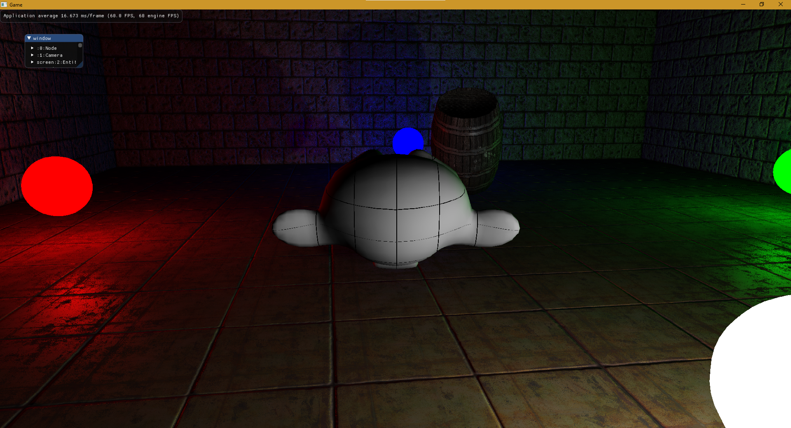

# BlueWork
This was an idea. A messy, over thought, and ambitious idea. Its not the most performant or the most intuitive. It is missing many major features that would make it useful, but it was a damn good learning experience. Hopefully someone will find it useful in learning some interesting ideas and learning from some bad ideas.

This was a second attempt at being too ambitious for my own good. Its been sitting in a private repo for some time now and I figured it might be a good example of me constantly spit balling.

### It has:
* a basic scene loading system
* shadows
* over-thought scene graph
* under-thought shadow rendering (but the soft shadows look pretty decent)
* a no-entity component system, because who needs entities anyway... or memory management, or performance, or a component system that makes sense

### It uses:
* https://github.com/Dav1dde/glad
* https://github.com/g-truc/glm
* https://github.com/glfw/glfw
* https://github.com/emilk/loguru
* https://github.com/nlohmann/json
* https://github.com/ocornut/imgui
* https://github.com/nothings/stb specifically stb_image.h
* some textures and models found on https://opengameart.org/

